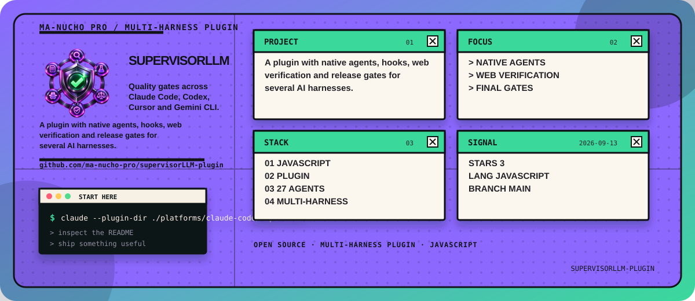

<!-- manucho-readme-banner:start -->
<p align="center">
  
</p>
<!-- manucho-readme-banner:end -->

<h1 align="center">SupervisorLLM</h1>

<p align="center">
  <strong>A universal multi-agent quality gate for AI coding agents.</strong>
</p>

<p align="center">
  Researches. Builds. Tests. Challenges. Verifies. Judges. Then releases.
</p>

<p align="center">
  
  
  
  
  
</p>

<p align="center">
  
  
  
  
</p>

<p align="center">
  <code>RESEARCH · BUILD · TEST · BREAK · FIX · VERIFY · JUDGE · RELEASE</code>
</p>

<p align="center">
  <a href="#why-supervisorllm">Why</a> ·
  <a href="#how-it-works">How it works</a> ·
  <a href="#supported-harnesses">Harnesses</a> ·
  <a href="#installation">Install</a> ·
  <a href="#claude-code">Claude Code</a> ·
  <a href="#cursor">Cursor</a> ·
  <a href="#codex">Codex</a> ·
  <a href="#gemini-cli">Gemini CLI</a> ·
  <a href="#agent-skills">Agent Skills</a> ·
  <a href="#architecture">Architecture</a>
</p>

---

SupervisorLLM is a multi-agent supervision system designed to prevent a convincing first draft from being confused with a verified final result.

Instead of allowing the agent that created the answer to immediately deliver it, SupervisorLLM introduces an independent quality pipeline around the work.

It can research externally verifiable claims, delegate implementation to specialists, inspect code and frontend quality, execute available tests, search for hallucinations, challenge assumptions, classify defects, request corrections, run regression checks, and submit the candidate to a final release judge.

The core principle is simple:

```text
FIRST DRAFT != FINAL RESULT
```

---

## Why SupervisorLLM?

Modern coding agents are extremely capable.

They can also produce output that appears correct while containing:

* outdated documentation
* invented APIs
* nonexistent packages
* incorrect methods
* fabricated URLs
* unsupported claims
* broken code
* incomplete requirements
* security weaknesses
* poor architecture
* visual frontend defects
* hidden edge cases
* incorrect calculations
* false claims of testing
* false claims of verification

SupervisorLLM is built around a different question.

> Not "How can we approve this result?"

But:

> "What could still prove that this result should not be released?"

---

## How it works

Without SupervisorLLM:

```text
USER
  |
  v
AGENT
  |
  v
FIRST RESULT
  |
  v
USER
```

With SupervisorLLM:

```text
USER REQUEST
      |
      v
UNDERSTAND INTENT
      |
      v
EXTRACT REQUIREMENTS
      |
      v
DEFINE ACCEPTANCE CRITERIA
      |
      v
WEB / FILE / RUNTIME EVIDENCE
      |
      v
ADAPTIVE FAN-OUT
      |
      +-------------------------+
      |                         |
      v                         v
IMPLEMENTERS               RESEARCHERS
      |                         |
      +------------+------------+
                   |
                   v
             CANDIDATE
                   |
                   v
        INDEPENDENT REVIEWERS
                   |
                   v
          SPECIALIST JUDGES
                   |
         +---------+---------+
         |                   |
         v                   v
HALLUCINATION CHECK       RED TEAM
         |                   |
         +---------+---------+
                   |
                   v
              FIND DEFECTS
                   |
                   v
               P0 - P4
                   |
             FAIL? |
               +---+---+
               |       |
              YES      NO
               |       |
               v       v
              FIX   FINAL JUDGE
               |       |
               v       |
             TEST      |
               |       |
               v       |
          REGRESSION   |
               |       |
               +---+---+
                   |
                 /LOOP
                   |
                   v
           FINAL RELEASE GATE
                   |
                   v
        VERIFICATION RECEIPT
                   |
                   v
                  USER
```

---

## The Supervisor rules

SupervisorLLM follows several non-negotiable rules:

```text
FIRST DRAFT != FINAL RESULT

IMPLEMENTER != REVIEWER

IMPLEMENTER != FINAL JUDGE

CLAIM != EVIDENCE

NOT FOUND != DOES NOT EXIST

CODE THAT LOOKS CORRECT != CODE THAT WAS TESTED

UI CODE THAT LOOKS GOOD != UI THAT WAS VISUALLY VERIFIED
```

The system must never claim that a test, web search, browser inspection, benchmark, render, subagent review, or validation happened when it did not actually happen.

When something cannot be verified:

```text
UNVERIFIED
```

is preferable to invented certainty.

---

# Supported harnesses

SupervisorLLM uses a shared universal Skill plus native adapters for the major AI coding harnesses.

| Harness                         | Universal Skill |   Native Adapter |    Specialists | Automated Release Review |
| ------------------------------- | --------------: | ---------------: | -------------: | -----------------------: |
| Claude Code                     |             Yes |              Yes |             27 |                      Yes |
| Cursor                          |             Yes |              Yes |             27 |                      Yes |
| Codex                           |             Yes |              Yes |    27 profiles |                      Yes |
| Gemini CLI                      |             Yes |              Yes |             27 |                      Yes |
| Agent Skills-compatible clients |             Yes |            Skill | Host dependent |           Host dependent |
| Other coding agents             |   Portable core | Adapter possible | Host dependent |           Host dependent |

SupervisorLLM does **not** pretend every harness uses the same extension format.

The reasoning protocol is shared.

The integration layer is native to each platform.

---

# One brain, multiple harnesses

```text
                   SUPERVISORLLM
                         |
             +-----------+-----------+
             |                       |
             v                       v
       UNIVERSAL SKILL          SHARED PROTOCOL
             |                       |
             +-----------+-----------+
                         |
                         v
                 SPECIALIST ROLES
                         |
        +----------------+----------------+
        |                |                |
        v                v                v
   Claude Code         Cursor           Codex
        |
        +----------------+----------------+
                         |
                         v
                     Gemini CLI
                         |
                         v
               Other Agent Skills
                    clients
```

This allows the same Supervisor philosophy to be reused without forcing Claude-specific hooks into Codex, Cursor-specific manifests into Gemini, or any other fake cross-platform compatibility.

---

# Web verification

SupervisorLLM is designed to use the host's real web/search/browser capabilities when information is externally verifiable and browsing is available.

This is especially important for:

```text
CURRENT DOCUMENTATION
FRAMEWORK VERSIONS
API BEHAVIOR
LIBRARIES
PACKAGES
CLI FLAGS
SECURITY GUIDANCE
BENCHMARKS
PRODUCT INFORMATION
TECHNICAL CLAIMS
DATES
NUMBERS
CURRENT EVENTS
EXTERNAL REFERENCES
```

The evidence pipeline is:

```text
SEARCH
   |
   v
PREFER OFFICIAL / PRIMARY SOURCES
   |
   v
CHECK FRESHNESS
   |
   v
CROSS-VERIFY MATERIAL CLAIMS
   |
   v
COMPARE SOURCES WITH CANDIDATE
   |
   v
HALLUCINATION CHECK
   |
   v
VERIFIED / INFERRED / DISPUTED / UNVERIFIED
```

SupervisorLLM never converts:

```text
I COULD NOT FIND IT
```

into:

```text
IT DOES NOT EXIST
```

without sufficient evidence.

---

# Anti-hallucination tribunal

SupervisorLLM contains specialists focused exclusively on truth and evidence.

```text
RESEARCHER
     |
     v
EVIDENCE JUDGE
     |
     v
SOURCE AUTHORITY JUDGE
     |
     v
HALLUCINATION HUNTER
     |
     v
CITATION ENTAILMENT JUDGE
     |
     v
NUMERICAL AUDITOR
     |
     v
SKEPTIC JUDGE
```

The Hallucination Hunter specifically searches for potentially fabricated:

* APIs
* functions
* methods
* packages
* CLI commands
* flags
* versions
* URLs
* dates
* statistics
* benchmarks
* test results
* citations
* documentation behavior
* runtime claims

---

# Coding supervision

SupervisorLLM contains a dedicated implementation specialist:

```text
CODE EXPERT
```

The Code Expert is expected to:

* inspect the existing repository first;
* understand its architecture before changing it;
* search current documentation when necessary;
* identify root causes instead of stacking patches;
* respect existing project conventions;
* implement the requested behavior;
* run the strongest practical validation available.

But the Code Expert cannot approve its own work.

A significant implementation may pass through:

```text
CODE EXPERT
     |
     v
CODE REVIEWER
     |
     v
TEST JUDGE
     |
     v
CORRECTNESS JUDGE
     |
     v
ARCHITECTURE JUDGE
     |
     v
SECURITY JUDGE
     |
     v
PERFORMANCE JUDGE
     |
     v
INTEGRATION JUDGE
```

Depending on the repository, evidence may include:

```text
BUILD

TYPECHECK

LINT

UNIT TESTS

INTEGRATION TESTS

E2E TESTS

RUNTIME OUTPUT

STATIC ANALYSIS

LOGS

BENCHMARKS
```

SupervisorLLM does not consider:

```text
"should work"

"probably fixed"

"looks correct"

"seems fine"
```

to be substitutes for executable evidence.

---

# Frontend supervision

SupervisorLLM also contains a dedicated:

```text
FRONTEND EXPERT
```

Frontend review can evaluate:

* visual hierarchy
* composition
* typography
* spacing
* alignment
* responsive behavior
* mobile behavior
* desktop behavior
* loading states
* empty states
* error states
* hover states
* focus states
* accessibility
* animation
* motion
* contrast
* visual consistency
* design-system consistency
* usability
* performance
* polish

When browser or rendering tools are available:

```text
IMPLEMENT
    |
    v
RUN
    |
    v
RENDER
    |
    v
SCREENSHOT / INSPECT
    |
    v
VISUAL JUDGE
    |
    v
ACCESSIBILITY JUDGE
    |
    v
FIND DEFECTS
    |
    v
FIX
    |
    v
RENDER AGAIN
    |
    v
COMPARE
    |
    v
RE-JUDGE
```

Looking at source code alone is not considered sufficient visual verification when actual rendering is available.

---

# 27 specialist roles

SupervisorLLM ships the same logical specialist roster across the native adapters.

```text
01  Requirements Judge
02  Researcher
03  Evidence Judge
04  Source Authority Judge
05  Hallucination Hunter
06  Citation Entailment Judge
07  Numerical Auditor
08  Code Expert
09  Frontend Expert
10  Code Reviewer
11  Architecture Judge
12  Test Judge
13  Integration Judge
14  Security Judge
15  Performance Judge
16  Visual Judge
17  Frontend Visual Judge
18  Accessibility Judge
19  Correctness Judge
20  Completeness Judge
21  User Intent Judge
22  Quality Judge
23  Robustness Judge
24  Skeptic Judge
25  Red Team Judge
26  Devil's Advocate
27  Final Judge
```

SupervisorLLM uses **adaptive fan-out**.

It does not run all 27 specialists for every trivial request just to increase agent count.

```text
SIMPLE TASK
    |
    v
SMALL SPECIALIST SET


MEDIUM TASK
    |
    v
MULTIPLE REVIEWERS


COMPLEX TASK
    |
    v
BROADER SPECIALIST PANEL


HIGH-RISK CODE / FRONTEND TASK
    |
    v
IMPLEMENTATION
+
RESEARCH
+
TESTING
+
SECURITY
+
VISUAL REVIEW
+
RED TEAM
+
FINAL RELEASE JUDGE
```

---

# Independent review

The most important separation in SupervisorLLM is:

```text
IMPLEMENTER != REVIEWER != FINAL JUDGE
```

The creator may perform self-review.

Self-review alone cannot approve a significant result.

---

# Red Team

The Red Team's purpose is not to make the work look good.

Its purpose is to break it.

It searches for:

```text
HIDDEN BUGS
UNSUPPORTED ASSUMPTIONS
MISSING REQUIREMENTS
EDGE CASES
BROKEN STATES
INCORRECT LOGIC
RACE CONDITIONS
FRAGILE IMPLEMENTATIONS
FAKE FUNCTIONALITY
HARDCODED SHORTCUTS
SECURITY RISKS
BAD UX
INTEGRATION FAILURES
UNVERIFIED CLAIMS
```

Its central question is:

> What would have to go wrong to prove that this result should not be released yet?

---

# Defect system

SupervisorLLM classifies detected problems by severity.

```text
P0  BLOCKING / CRITICAL
P1  MAJOR
P2  MODERATE
P3  MINOR
P4  COSMETIC
```

Before a normal release:

```text
ALL P0 -> MUST BE FIXED

ALL P1 -> MUST BE FIXED
```

Material P2 issues should also be corrected when they significantly affect correctness, quality, reliability, security, or user experience.

---

# Root-cause correction

SupervisorLLM discourages patch stacking.

Instead of:

```text
BUG
 |
 v
PATCH
 |
 v
PATCH
 |
 v
PATCH
```

it prefers:

```text
BUG
 |
 v
IDENTIFY ROOT CAUSE
 |
 v
FIX LOGIC / ARCHITECTURE
 |
 v
REMOVE WORKAROUNDS
 |
 v
RETEST
 |
 v
REGRESSION TEST
```

After a significant defect is found, reviewers should ask:

```text
Why did this bug exist?

Can the same class of bug exist elsewhere?

Which assumption failed?

Should architecture change?

Should tests be expanded?

Could the fix have broken something that worked before?
```

---

# Judge scoring

Specialist judges can score their assigned dimension from:

```text
0 - 49    Unacceptable
50 - 69   Weak
70 - 79   Acceptable
80 - 89   Good
90 - 94   Excellent
95 - 100  Exceptional
```

Default critical threshold:

```text
>= 90
```

When the user explicitly requests exceptional, premium, publication-grade, production-grade, AAA, or best-possible quality:

```text
>= 95
```

A specialist may also issue a veto for a material critical problem.

---

# The /loop

SupervisorLLM does not stop simply because a first correction was made.

```text
IMPLEMENT
    |
    v
RUN
    |
    v
INSPECT
    |
    v
TEST
    |
    v
REVIEW
    |
    v
JUDGE
    |
    v
IDENTIFY DEFECTS
    |
    v
PRIORITIZE
    |
    v
FIX
    |
    v
REGRESSION TEST
    |
    v
RE-JUDGE
    |
    v
/LOOP
```

The loop is bounded.

SupervisorLLM should not create an infinite polishing cycle.

Iteration stops when material blockers are resolved, critical requirements pass, no critical veto remains, regression checks pass, and additional iterations no longer provide meaningful improvement.

---

# Final release gate

Before a significant result reaches the user:

```text
CANDIDATE RESPONSE
        |
        v
FINAL RELEASE JUDGE
        |
        +---------------------------+
        |                           |
        v                           v
USER INTENT                   REQUIREMENTS
        |                           |
        v                           v
EVIDENCE                      CORRECTNESS
        |                           |
        v                           v
TEST STATUS                   HALLUCINATIONS
        |                           |
        v                           v
OPEN P0 / P1                  OVERCLAIMS
        |                           |
        +-------------+-------------+
                      |
                      v
                    READY?
                   /      \
                 NO        YES
                 |          |
                 v          v
              BLOCK       RELEASE
                 |
                 v
            RETURN TO LOOP
```

---

# Verification Receipt

Substantive released answers should include a concise record of what was actually verified.

Example:

```text
Verification Receipt

Web
- Official framework documentation checked
- Current API behavior cross-verified

Local
- Build passed
- Typecheck passed
- Tests passed

Independent review
- Code review completed
- Correctness review completed
- Hallucination review completed
- Final release review completed

Unverified
- None known
```

If something did not happen, it must not appear in the receipt.

---

# Architecture

```text
supervisor/
|
|-- README.md
|
|-- assets/
|   `-- supervisor-logo.png
|
|-- skill/
|   `-- supervisor/
|       |-- SKILL.md
|       `-- references/
|
|-- .agents/
|   `-- skills/
|       `-- supervisor/
|
|-- shared/
|   `-- agents/
|
|-- platforms/
|   |
|   |-- claude-code/
|   |   `-- supervisor/
|   |
|   |-- cursor/
|   |   `-- supervisor/
|   |
|   |-- codex/
|   |   `-- supervisor/
|   |
|   |-- gemini-cli/
|   |   `-- supervisor/
|   |
|   `-- agent-skills/
|       `-- supervisor/
|
|-- distributions/
|   |-- supervisor-universal.skill
|   |-- supervisor-claude-code.zip
|   |-- supervisor-cursor.zip
|   |-- supervisor-codex.zip
|   `-- supervisor-gemini-cli.zip
|
`-- scripts/
    `-- validate-universal.mjs
```

---

# Installation

Clone the repository:

```bash
git clone https://github.com/YOUR-USERNAME/supervisorllm.git
cd supervisorllm
```

Or on GitHub:

```text
Code
  |
  v
Download ZIP
  |
  v
Extract
  |
  v
Choose your harness below
```

---

# Claude Code

The Claude Code adapter is located at:

```text
platforms/claude-code/supervisor
```

Load it directly from the cloned repository:

```bash
claude --plugin-dir ./platforms/claude-code/supervisor
```

Or use the packaged distribution:

```bash
claude --plugin-dir ./distributions/supervisor-claude-code.zip
```

Invoke the Skill:

```text
/supervisor:supervisor <your task>
```

Example:

```text
/supervisor:supervisor Implement this feature, verify the framework against current official documentation, run the relevant tests, review the implementation independently, and do not release the result until the final gate passes.
```

Useful Claude Code commands:

```text
/agents

/help

/reload-plugins
```

The Claude adapter includes:

```text
Universal Skill
27 specialist agents
Hooks
Prompt supervision
Final Stop release judge
```

---

# Cursor

The Cursor adapter is located at:

```text
platforms/cursor/supervisor
```

For local plugin development, copy or link the directory into:

```text
~/.cursor/plugins/local/supervisor
```

macOS / Linux:

```bash
mkdir -p ~/.cursor/plugins/local

ln -s "$(pwd)/platforms/cursor/supervisor" \
  ~/.cursor/plugins/local/supervisor
```

Windows PowerShell:

```powershell
New-Item -ItemType Directory -Force "$HOME\.cursor\plugins\local" | Out-Null

Copy-Item -Recurse -Force `
  ".\platforms\cursor\supervisor" `
  "$HOME\.cursor\plugins\local\supervisor"
```

Restart Cursor or run:

```text
Developer: Reload Window
```

When SupervisorLLM is published to the Cursor Marketplace:

```text
/add-plugin supervisor
```

The Cursor adapter contains:

```text
Universal Skill
27 subagents
Supervisor Rule
Hooks
Bounded stop review
```

---

# Codex

The Codex adapter is located at:

```text
platforms/codex/supervisor
```

SupervisorLLM supports two installation approaches.

## Codex — Skill only

Copy the universal Skill into your project's Agent Skills folder.

macOS / Linux:

```bash
mkdir -p .agents/skills

cp -R /path/to/supervisorllm/skill/supervisor \
  .agents/skills/supervisor
```

Windows PowerShell:

```powershell
New-Item -ItemType Directory -Force ".agents\skills" | Out-Null

Copy-Item -Recurse -Force `
  "C:\path\to\supervisorllm\skill\supervisor" `
  ".agents\skills\supervisor"
```

Restart or refresh Codex after installation.

## Codex — Native package

The native package contains:

```text
.codex-plugin/plugin.json

skills/supervisor/

hooks/hooks.json

scripts/

native-agents/
```

The repository also includes optional Codex agent profiles.

Install the profiles into a target project:

```bash
node platforms/codex/supervisor/scripts/install-native-agents.mjs /path/to/your/project
```

This creates:

```text
your-project/
└── .codex/
    └── agents/
        ├── supervisor-code-expert.toml
        ├── supervisor-red-team.toml
        ├── supervisor-final-judge.toml
        └── ...
```

The Codex adapter provides:

```text
Universal Skill
Codex plugin manifest
27 optional agent profiles
Lifecycle hooks
Preflight
Final Stop gate
```

---

# Gemini CLI

The Gemini CLI adapter is located at:

```text
platforms/gemini-cli/supervisor
```

Install from the cloned repository:

```bash
gemini extensions install ./platforms/gemini-cli/supervisor
```

For extension development:

```bash
gemini extensions link ./platforms/gemini-cli/supervisor
```

Verify the installation:

```text
/extensions list

/skills list

/agents
```

The Gemini adapter contains:

```text
gemini-extension.json
Universal Skill
27 subagents
BeforeAgent supervision
AfterAgent release review
Hooks
```

The `AfterAgent` layer is used as the final response-validation stage for the Gemini adapter.

---

# Agent Skills

The portable SupervisorLLM Skill lives at:

```text
skill/supervisor/
```

and is also mirrored at:

```text
.agents/skills/supervisor/
```

The universal package is:

```text
distributions/supervisor-universal.skill
```

Agent Skills are designed as a portable format built around:

```text
SKILL.md
```

plus optional:

```text
scripts/
references/
assets/
```

For another compatible harness, install the `supervisor` Skill directory into that client's supported Agent Skills location.

The universal Skill preserves:

* supervision protocol
* evidence policy
* anti-hallucination workflow
* code-review workflow
* frontend-review workflow
* P0-P4 classification
* judge contracts
* scoring system
* Red Team behavior
* root-cause loop
* Verification Receipt
* final-release decision protocol

Native lifecycle hooks and exact subagent schemas remain platform-specific.

---

# Other agents and harnesses

SupervisorLLM is designed around a portable core.

If another agent supports the open Agent Skills format, start with:

```text
skill/supervisor/
```

If the host additionally supports:

```text
SUBAGENTS
HOOKS
MCP
WEB SEARCH
BROWSER TOOLS
SHELL
TEST EXECUTION
```

a native adapter can extend SupervisorLLM with stronger enforcement.

The rule is:

```text
PORT THE SUPERVISION LOGIC

DO NOT FAKE HOST CAPABILITIES
```

A host without lifecycle hooks can still use the Supervisor Skill.

It simply cannot claim the same hard automatic final gate as a host that provides one.

---

# Repository validation

Run:

```bash
node scripts/validate-universal.mjs .
```

This performs repository-level static validation.

Harness-native validation should still be performed with the corresponding platform before publishing a release.

---

# Platform documentation

SupervisorLLM's adapters follow the native extension mechanisms of their respective hosts.

| Platform                     | Documentation                                       |
| ---------------------------- | --------------------------------------------------- |
| Claude Code Plugins          | `https://code.claude.com/docs/en/plugins`           |
| Claude Code Plugin Reference | `https://code.claude.com/docs/en/plugins-reference` |
| Cursor Plugins               | `https://cursor.com/docs/plugins`                   |
| Cursor Marketplace           | `https://cursor.com/marketplace`                    |
| OpenAI Plugins               | `https://developers.openai.com/`                    |
| OpenAI Codex / Agent Skills  | `https://github.com/openai/plugins`                 |
| Gemini CLI Extensions        | `https://geminicli.com/docs/extensions/`            |
| Agent Skills Standard        | `https://agentskills.io/`                           |

---

# The SupervisorLLM principle

SupervisorLLM is not designed to make the first answer look more convincing.

It is designed to make the final answer **more difficult to falsely approve**.

```text
DON'T TRUST
     |
     v
VERIFY


DON'T ASSUME
     |
     v
RESEARCH


DON'T GUESS
     |
     v
TEST


DON'T SELF-APPROVE
     |
     v
INDEPENDENT REVIEW


DON'T PATCH FOREVER
     |
     v
FIND THE ROOT CAUSE


DON'T SHIP THE FIRST DRAFT
     |
     v
SUPERVISE IT
```

---

<p align="center">
  <strong>SupervisorLLM</strong>
</p>

<p align="center">
  Research. Build. Test. Challenge. Verify. Judge. Release.
</p>

<p align="center">
  <sub>The answer is not ready because it exists. It is ready when it survives review.</sub>
</p>
